# SQL Server

## Installation

Follow this [steps](https://www.sqlshack.com/step-by-step-installation-of-sql-server-2017) to install SQL Server Developer Edition  

## Setup

### Enable TCP/IP connections

1 - Enable TCP/IP

### 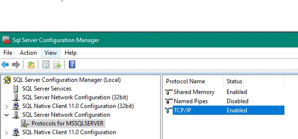

2 - Specify the port `1433`

### 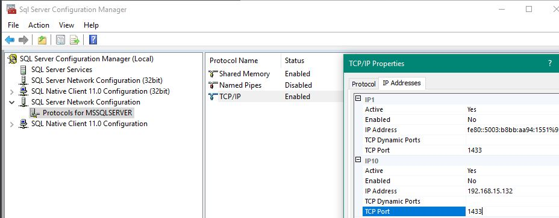

3 - Restart the service

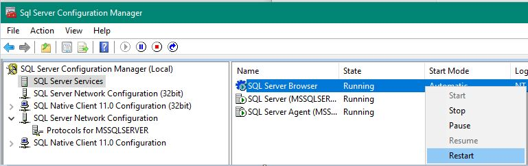

References

:link:[Cannot connect to to SQL](https://dba.stackexchange.com/questions/62165/i-cant-connect-to-my-servers-sql-database-via-an-ip-address)

### Create a new instance

In command prompt type the following command

```bash
sqllocaldb create "<instanceName>"
sqllocaldb start "<instanceName>"
```

### Open the instance into Microsoft SQL Server Management Studio 2017

Once you open `Microsft SQL Server Management Studio 2017` the following window will appear

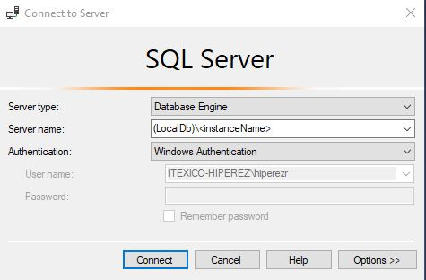

The important fields are:

- Server name: `LocalDb`\\<instanceName>
- Windows Authentication

### Create a new database

#### Graphical Way

In the `Object Explorer` (right side), right click to see the `New Database` option

## 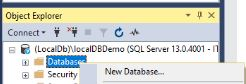

#### Command line way

```sql
CREATE DATABASE <databaseName>;
```


## Definition

SQL stands for `Structured Query Language` is a special-purpose programming language

## Purpose

- To manipulate sets of data
- Typically from a relational database
- ANSI and ISO standards

## Index

Available index types

| Index Type   | Definition                                                   | Links                                                        |
| ------------ | ------------------------------------------------------------ | ------------------------------------------------------------ |
| Clustered    | A clustered index sorts and stores the data rows of the table or view in order based on the clustered index key. The clustered index is implemented as a B-tree index structure that supports fast retrieval of the rows, based on their clustered index key values. | [Clustered and Nonclustered Indexes Described](https://docs.microsoft.com/en-us/sql/relational-databases/indexes/clustered-and-nonclustered-indexes-described?view=sql-server-2017) \| [Create Clustered Indexes](https://docs.microsoft.com/en-us/sql/relational-databases/indexes/create-clustered-indexes?view=sql-server-2017) \|  [Clustered Index Design Guidelines](https://docs.microsoft.com/en-us/sql/relational-databases/sql-server-index-design-guide?view=sql-server-2017#Clustered) |
| Nonclustered | A nonclustered index can be defined on a table or view with a clustered index or on a heap. Each index row in the nonclustered index contains the nonclustered key value and a row locator. This locator points to the data row in the clustered index or heap having the key value. The rows in the index are stored in the order of the index key values, but the data rows are not guaranteed to be in any particular order unless a clustered index is created on the table. | [Clustered and Nonclustered Indexes Described](https://docs.microsoft.com/en-us/sql/relational-databases/indexes/clustered-and-nonclustered-indexes-described?view=sql-server-2017) \| [Create Nonclustered Indexes](https://docs.microsoft.com/en-us/sql/relational-databases/indexes/create-nonclustered-indexes?view=sql-server-2017) \| [Nonclustered Index Design Guidelines](https://docs.microsoft.com/en-us/sql/relational-databases/sql-server-index-design-guide?view=sql-server-2017#Nonclustered) |
| Unique       | A unique index ensures that the index key contains no duplicate values and therefore every row in the table or view is in some way unique. | [Create Unique Indexes](https://docs.microsoft.com/en-us/sql/relational-databases/indexes/create-unique-indexes?view=sql-server-2017) \| [Unique Index Design Guidelines](https://docs.microsoft.com/en-us/sql/relational-databases/sql-server-index-design-guide?view=sql-server-2017#Unique) |

:link: [More Official information here](https://docs.microsoft.com/en-us/sql/relational-databases/indexes/indexes?view=sql-server-2017)

## Indexes and Constraints

Indexes are automatically created when PRIMARY KEY and UNIQUE constraints are defined on table columns. For example, when you create a table with a UNIQUE constraint, Database Engine automatically creates a non-clustered index. If you configure a PRIMARY KEY, Database Engine automatically creates a clustered index, unless a clustered index already exists. When you try to enforce a PRIMARY KEY constraint on an existing table and a clustered index already exists on that table, SQL Server enforces the primary key using a nonclustered index.

For more information, see [Create Primary Keys](https://docs.microsoft.com/en-us/sql/relational-databases/tables/create-primary-keys?view=sql-server-2017) and [Create Unique Constraints](https://docs.microsoft.com/en-us/sql/relational-databases/tables/create-unique-constraints?view=sql-server-2017).

## Working with Tables

### Create a new table

Click on the `New Query` button and then insert the following

```sql
CREATE TABLE Users(
	email VARCHAR(50)
);
```

> Where
>
> - create table => means literally to create a new table
> - Users = > the table's name
>   - email => the column name
>     - varchar => that the content of the row will be of type character
>       - 50 = the row's length

Once you type the code, click on execute button, then right click over `Tables` folder to refresh the tables due to `SQL Server Management Studio` does not refresh automatically

To see the table created go to next path

`Databases` => *<*dataBaseName*>* => Tables 

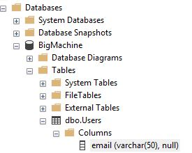

### Delete a table

To drop a table type the following content into a `New Query`

```sql
DROP TABLE Users;
```

> Where
>
> - Users => is the table's name

Same as above, refresh in order to update the content

## Primary Keys

 As the name implies it is just a constraint, and with that constraint you tell SQL Server that you want to have unique values in a specific column or in a specific group of columns

When you specify the Primary Key constraint, you can specify the following 2 options:

- CLUSTERED
- NONCLUSTERED

The option **CLUSTERED** is the default one, and therefore you don’t have to specify it

### Integer Primary Key

`Primary key` gives an unique id in the table, e.g:

```sql
CREATE TABLE Users(
	Id INTEGER PRIMARY KEY
);
```

> Where
>
> - Id => is the name of the column
>   - INTEGER=> is the type of data that will be in each row
>   - PRIMARY KEY => specifies explicitly that it would be a `PRIMARY KEY`

output:

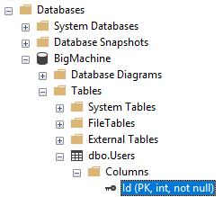

### GUID Primary Keys

```sql
CREATE TABLE Users(
	Id UNIQUEIDNETIFIER PRIMARY KEY
);
```

output

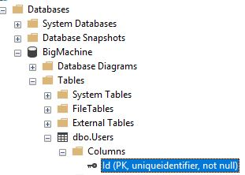

### Incrementing primary key

The use of this is to increase the `Id` column into 1 when a new data would be inserted in the table

```sql
CREATE TABLE Users(
	Id INTEGER PRIMARY KEY IDENTITY(1,1),
    email varchar(50)
);
```

> where:
>
> - IDENTITY => the first `1` means that it will start from that number, the second `1` it means that the increment would be of `1`

### Incrementing GUID Primary Keys

```sql
CREATE TABLE Users(
	Id UNIQYEIDENTIFIER PRIMARY KEY DEFAULT NEWID(),
    email VARCHAR(50)
);
```


>  where:
>
> - DEFAULT NEWID() => it's a built-in function that will return a new GUID like `75sdsad1-245dsadsa ...`

### Tangent: Choosing a key

- GUID cons
  - it's quite large
  - will take a space
- Integer cons
  - is limited to 2147483647 integers


The better options for big database is the GUID

### Composite Primary Keys

The following structure is know as `many to many relationships`

```sql
CREATE TABLE Users(
	Id INTEGER PRIMARY KEY IDENTITY(1,1),
    email VARCHAR(50) NOT NULL
);
CREATE TABLE Users_Roles(
	UserId integer,
    RoleId integer,
    PRIMARY KEY(UserId, RoleId)
);
CREATE TABLE Roles(
	Id INTEGER PRIMARY KEY IDENTITY(1,1),
    Name VARCHAR(50)
);
```

> Where:
>
> PRIMARY KEY(UserId, RoleId) => is to avoid duplicates in the table `Users_Roles`

## Defining columns

```sql
CREATE TABLE Users(
	Id INTEGER PRIMARY KEY IDENTITY(1,1) NOT NULL,
    Email VARCHAR(25)  NOT NULL UNIQUE,
    MoneySpent DECIMAL(10,2),
    CreateAt DATETIME NOT NULL,
    First VARCHAR(25),
    Last VARCHAR(25),
    Bio VARCHAR(max)
);
```

> Where:
>
> NOT NULL => means that this fields is required and cannot be empty
>
> UNIQUE=> means that this value cannot be repeated in the table
>
> DECIMAL(10,2) => means that it will accept a maximum of 10 as length with 2 decimals (this will rounded any decimal)
>
> DATETIME=> You must specified a timestamp `00:00:00 00:00:00.000`
>
> VARCHAR(max)=> it will accept the maximum allowed length for characters in this cell

## Columns defaults

```sql
CREATE TABLE Users(
	Id INTEGER primary key identity(1,1) NOT NULL,
    Email VARCHAR(25) NOT NULL unique,
    MoneySpent decimal(10,2) default 0,
    CreateAt DATETIME NOT NULL default getdate(),
    First VARCHAR(25),
    Last VARCHAR(25),
    Bio VARCHAR(max)
);
```

> Where:
>
> default 0 => means that if the user does not specify any value for this cell the default value will be 0
>
> default getdate() => means that if the user does not specify any date the default value will be the current date

 # Working with Data

## Inserting Data

```sql
INSERT INTO Users(Email, CreateAt, First, Last, Bio)
VALUES('test@test.com', getdate(), 'Test', 'User', 'Some person');
```

> Where:
>
> INSERT INTO <tableName>(<columnName1>,<columnName1>)
>
> VALUES => must be follow the order from above

Note: `SQL-Server` is not case sensitive, and it uses *single quotes* for `varchar`

To consult the data create type the following command:

```sql
SELECT * FROM Users;
```

Output:

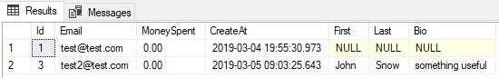


## Bulk Inserts

To Demonstrate how to perform a `bulk insert` in a database we will use `Chinook Database`

### Chinook Database

Chinook is a sample database available for SQL Server, Oracle, MySQL, etc. It can be created by running a single SQL script. 

#### Setup

Step 1 - Download the following files for `SQL-Server` from [DataSources](https://github.com/lerocha/chinook-database/tree/master/ChinookDatabase/DataSources)

:link: [Chinook_SqlServer.sql](https://raw.githubusercontent.com/lerocha/chinook-database/master/ChinookDatabase/DataSources/Chinook_SqlServer.sql)

:link: [Chinook_SqlServer_AutoIncrementPKs.sql](https://raw.githubusercontent.com/lerocha/chinook-database/master/ChinookDatabase/DataSources/Chinook_SqlServer_AutoIncrementPKs.sql)

Step 2 - Open them in `Microsoft SQL Server Management Studio` and execute them with `F5`

Output:

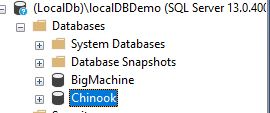

### Inserting the data

We have to use `dbo.Customer` table from `Chinook` to insert some columns into `dbo.Users` table

```sql
INSERT INTO Users(Email, First, Last)
SELECT Email, FirstName, LastName
FROM Chinook.dbo.Customer
```

Considerations

In the case that some column in the database differ in length, e.g:

| Column Name | Data Type   | VS   | Column Name | Data Type  |
| ----------- | ----------- | ---- | ----------- | ---------- |
| Email       | nvachar(40) |      | Email       | vachar(30) |

There is a problem because you cannot insert the data from the table `A` to table `B` since the length is different, in this case you have to perform the following steps in `Microsoft SQL Server Management Studio`

>  Tools > Options > Designers > Table and Database Designers > `uncheck` => "Prevent saving changes that require table re-creation"

Now, right click under the table with less length and select `Design`, then increase the `Data Type` correspondent.

Close the `Design` window and save the changes performed


Generally speaking, `Microsoft SQL Management Studio` will properly handle dependencies when you modify a table in a way that requires it to be recreated (it will do assorted tricks with temp tables behind the scenes, which you can see if you tell it to generate a change script instead of actually making the changes). However, this may involve modifications/changes to related tables or foreign keys. In other words, don't do this on a live system if you can help it, and make sure you've got backups before you do it.

## Updating Data

### Single record

Structure

```sql
UPDATE <tableName> SET
<columnName> = '09/23/2014'
WHERE <columnName> = <someId>;
```

e.g:

```sql
UPDATE Users SET
CreateAt = '09/23/2014'
WHERE Id=1;
```

### Bulk Updates

```sql
UPDATE Users SET
CreateAt = '09/23/2012'
WHERE Id <= 10;
```

## Deleting Data

### Single record

```sql
DELETE from Users
WHERE Id=1;
```

### Bulk Delete

#### With Criteria

```sql
DELETE from Users
WHERE Id <= 10;
```

#### All table

```sql
DELETE from Users;
```

# Querying Data

## Simple Select

```sql
SELECT *
from <tableName>
```

> Where:
>
> \* => this wildcard means that will select everything from the table

## Select Columns

```sql
SELECT <columnName>,<columnName>
-- SELECT *
from <tableName>
```

> Where:
>
> `-- ` => is the way to put comments in `SQL Server`

## Aliasing Columns

```sql
SELECT <columnName> as 'someName', <columnName> as 'someOtherName'
from <tableName>
```

With the above command the original columns name will be overwriting with the alias assigned

## Column Expressions

```sql
SELECT <columnName> + ' ' + <otherColumnName> as 'customColumnName'
from <tableName>
```

The above code will `concatenate` two columns in one with a custom column name, if we omitted the alias  we will have `No column name` because the concatenation of two columns will be the value instead of the column name

## Spaces into Columns Names

### Create a column with spaces

To add a column name with a space the code is the following:

```sql
ALTER TABLE <tableName> ADD [<columnName>] VARCHAR(50) NULL
```

> Where:
>
> - `VARCHAR(50)` and `NULL` as parameters and could be replaced by others parameters

Notice that `columnName` is surrounded by *braces* and this is because the column name will have spaces

### Consult a column with spaces

```sql
SELECT [column Name]
from <tableName>;
```


#  Joining Tables

## Inner Joins

To explain more in detail this topic perform the following steps

1 - Create a new database

```sql
CREATE DATABASE production;
```

2 - Create a new table for `production database`

```sql
USE [production]
GO
create table products(
	product_id INTEGER PRIMARY KEY IDENTITY(1,1) NOT NULL,
	product_name VARCHAR(50) NOT NULL,
	brand_id VARCHAR(50) NOT NULL,
	category_id INTEGER NOT NULL,
	model_year INTEGER NOT NULL,
	list_price DECIMAL(10, 2) NOT NULL
);
GO
```

*NOTE*: Please `Refresh` the Databases into `Microsoft SQL Server Management Studio` to continue

3 - Add some information to `products` table

```sql
USE [production]
GO

INSERT INTO [dbo].[products]
	(product_name, brand_id, category_id, model_year, list_price)
VALUES
	('Mazda 3', 'Mazda', 1, 2019, 407005.87),
	('Mazda 2', 'Mazda', 2, 2019, 197000.85);
GO


```

Note: with the above code we avoid to get errors when insert data to the table due to `Microsoft SQL Server Management Studio` does not refresh the cache automatically, but if this does not works please `refresh` the Databases manually

4 - Create a new table for `categories`

```sql
USE [production]
GO
create table categories(
	category_id INTEGER PRIMARY KEY IDENTITY(1,1) NOT NULL,
	category_name VARCHAR(50) NOT NULL
);
USE [production]
GO
```

5 - Add some information to `categories` table

```sql
USE [production]
GO

INSERT INTO [dbo].[categories]
	(category_name)
VALUES
	('Hasback'),
	('Compact');
GO

```

At this point the tables would looks like this

`for products table`

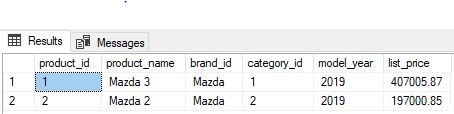

`for categories table`

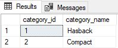

Suppose that from `products table` you need to know what kind of car is the Mazda 3, basically the logic is like this

The column `category_id` in the table `products` is linked directly to the column called in the same way in `categories` table, know this we can perform a query where we have the following 3 fields (for instance)

- product_name (coming from `products` table)
- category_name (coming from `categories table)
- list_price (coming from `products` table)

The code for this is:

```sql
USE production
GO
	SELECT
		product_name, category_name, list_price
	FROM products p
	INNER JOIN categories c ON c.category_id = p.category_id;
go
```

> Where:
>
> USE => is a keyword to indicate explicitly which database we want to use
>
> GO => the code inside here will be executed in the database previously mentioned
>
> SELECT => we can select the `columnsName` from both tables in the order we want
>
> FROM => specified a table and the word `p` is an aliases (to not write to much ;))
>
> INNER JOIN => the query to be perfumed 

In this query, the `INNER JOIN` clause matches rows from both `products` and `categories` tables. If a row in the `products` table has the same value in the `category_id` column as a row in the `categories` table, the query combines the values of columns specified in the `SELECT` list into a new row and includes that new row in the result set.

*In few words,`INNER JOIN` works like an `if statement`, if this is true, this will create a table with the elements specified in `SELECT` keyword*

Reference: [SQL Server Inner Join](http://www.sqlservertutorial.net/sql-server-basics/sql-server-inner-join)

## Subqueries

```sql
USE Chinook
GO
	SELECT *,
	(
		SELECT COUNT(1) 
			FROM Album 
			WHERE Album.ArtistId = Artist.ArtistId
	) as AlbumCount
	FROM Artist
ORDER BY AlbumCount;
go
```

> Where:
>
> - The parenthesis => is the subquery to perform
>   - SELECT COUNT(1) => counter to increment in 1 when the condition is meet
>   - FROM => The table to compare
>   - WHERE => the condition to meet
>   - as AlbumCount => the name of the new column to be created
> - ORDER BY => order the table by an specific column

## Left and Right Joins

`INNER JOIN` will not shows element that does not meet with the specific condition, for that reason *LEFT* and *RIGHT* are useful here

```sql
USE Chinook
GO
	SELECT Name, Title
	FROM Artist
	LEFT JOIN Album on Album.ArtistId = Artist.ArtistId
GO
```

This code means that if the condition does not meet it has to appears in the output table as a `NULL` in the right side.

With the *`RIGHT`* keyword happen the same situation, the data as `NULL` will appears in the left side (if any)

## Full Joins

```sql
USE Chinook
GO
	SELECT Name, Title
	FROM Artist FULL JOIN Album
	ON Album.ArtistId = Artist.ArtistId
GO
```

It has the same effect that `Left` and `Right` `JOINs`

# Filtering, Sifting, and Sorting Data

## Ordering Results

```sql
USE Chinook
GO
SELECT FirstNAme + ' ' + LastName as Name, Email, Country, InvoiceId, InvoiceDate, Total
FROM Customer c
INNER JOIN Invoice i on i.CustomerId = c.CustomerId
WHERE Country = 'Brazil'
ORDER BY Total DESC;
GO

```

> Where:
>
> - WHERE => is to filter results
> - ORDER BY => the results will be ordered from the column `Total`
>   - DESC => the results will be ordered in `descending way`


## Limiting Results

```sql
USE Chinook
GO
SELECT TOP 10 FirstNAme + ' ' + LastName as Name, Email, Country, InvoiceId, InvoiceDate, Total
FROM Customer c
INNER JOIN Invoice i on i.CustomerId = c.CustomerId
WHERE Country = 'Brazil'
ORDER BY Total DESC;
GO
```

The main difference between this example and the previous one is the use of the keyword `SELECT TOP 10` where it is indicated that the query will only shows the first 10 results

## Sequential Ordering

```
USE Chinook
GO
SELECT TOP 10 FirstNAme + ' ' + LastName as Name, Email, Country, InvoiceId, InvoiceDate, Total
FROM Customer c
INNER JOIN Invoice i on i.CustomerId = c.CustomerId
WHERE Country = 'USA'
OR Country = 'Canada'
ORDER BY Country DESC, LastName DESC;
GO
```

Practically it is the same command that the previous one, only `extends` the functionality of `WHERE` keyword

Some comments here:

- `OR` keyword has the functionality of `AND` keyword in other languages
- Even though `LastName` it is not specified in `SELECT` statement, we can use it

## Filtering by Sets

```sql
USE Chinook
GO
SELECT TOP 10 FirstNAme + ' ' + LastName as Name, Email, Country, InvoiceId, InvoiceDate, Total
FROM Customer c
INNER JOIN Invoice i on i.CustomerId = c.CustomerId
WHERE Country IN ('USA', 'Canada')
AND Total > 5
ORDER BY Country DESC, LastName DESC;
GO
```

This code is more readable than the `sequential order` specific in the `WHERE` keyword.

A new keyword was introduced and it is `AND` that reduces the query even more to get more specific details.

References:

:link: [Difference between TOP and OFFSET/FEACH](https://www.essentialsql.com/what-is-the-differenence-between-top-and-offset-fetch)

## Offsetting Results

You have to use `ORDER BY` clause together with `OFFSET` & `FETCH NEXT` the reason is because they are part of the clause

### OFFSET

```sql
USE Chinook
GO
	SELECT *
	FROM Artist
	ORDER BY Name
	OFFSET 1 ROW
GO
```

>  Where:
>
> - `OFFSET 1 ROW` => literally is to drop one column from the results

### FETCH NEXT

```sql
USE Chinook
GO
	SELECT *
	FROM Artist
	ORDER BY Name
	OFFSET 0 ROW
	FETCH NEXT 10 ROWS ONLY
GO
```

This code is similar to use `TOP` clause because it will show only 10 results

`FETCH NEXT` has to be used together with `OFFSET`

With `OFFSET 0` not rows are skipped

# Aggregates and Analysis

## Basic Aggregates

```sql
USE Chinook
SELECT
GO
	SUM(Total) as AllTimeSales
	AVG(Total) as AvgSale,
	COUNT(Total) as SalesCount,
	MIN(Total) as SmallestSale,
	MAX(Total) as BiggestSale
GO
FROM Invoice;
```

> Where:
>
> - Total => is the column
> - as => the alias for that column 
> - `SUM` => it is an aggregate (like a function) to get the *sum* of the column
> - AVG => to get the Average
> - COUNT => to get the total elements in the column
> - MIN => to get the min element in the column
> - MAX => to get the max element in the column

## Grouping Results

```sql
USE Chinook
GO
	SELECT BillingCountry,
	SUM(Total) as AllTimeSales
	FROM Invoice
	GROUP BY BillingCountry
GO
```

This is useful to show only the desired column together with a specific filter

In this case the column `BillingCountry` will shows first with the `aggregate` *SUM* to the right, *all columns into `SELECT` clause must be in `GROUP BY` clause*

## Having Clause

The HAVING clause was added to SQL because the WHERE keyword could not be used with aggregate function

```sql
USE Chinook
GO
    SELECT Country,
        COUNT(CustomerID) as Count
    FROM Customers
    GROUP BY Country
    HAVING COUNT(CustomerID) = 5;
GO
```

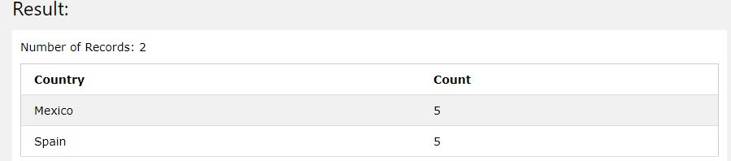

Reference:

:link: [Having Clause](https://www.w3schools.com/sql/sql_having.asp)

# Many to Many and Self-referencing Relationships

When normalizing a database or adding tables to an exiting database, we need to be able to relate tables to each other.

There are three ways in which a table can be related to another table:

1. *One-to-one*: A record in one table is related to one record in another table
2. *One-to-many*: A record in one table is related to many records in another table
3. *Many-to-many*: Multiple records in one table are related to multiples records in another table

Handling a `one-to-one` relationship or `one-to-many` relationship can be done by adding the primary key of one table into the other table as a foreign key.

However, for `many-to-many` relationships, it's a bit different.

e.g, create the following tables and contents:

```sql
USE [bom]
GO
	CREATE TABLE Student(
		StudentID INTEGER PRIMARY KEY IDENTITY(1,1) NOT NULL,
		StudentName VARCHAR(50) NOT NULL
	);
GO

USE [bom]
GO
	CREATE TABLE Class(
		ClassID INTEGER PRIMARY KEY IDENTITY(1,1) NOT NULL,
		ClassName VARCHAR(50) NOT NULL
	);
GO

USE [bom]
GO
	INSERT INTO Class(ClassName)
	VALUES('English'), ('Maths'), ('Spanish'), ('Biology'), ('Science'), ('Programming'), ('Law'), ('Commerce'), ('Physical Education');

GO

USE [bom]
GO
	INSERT INTO Student(StudentName)
	VALUES('John'), ('Debbie'), ('Matwee'), ('Paul'), ('Gregory'), ('Luis');

GO
```

You will have the following

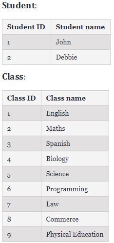

Create the table `many-to-many`

```sql
USE [bom]
GO
	CREATE TABLE StudentClass(
	    StudentID INTEGER NOT NULL,
        ClassID INTEGER NOT NULL,
        PRIMARY KEY(StudentID, ClassID)
	);
GO

```

Insert data in the `many-to-many` table

```sql
USE [bom]
GO
	INSERT INTO StudentClass(StudentID, ClassID)
	VALUES(1, 1);
GO
```

The above code will produce the following table where it says that the student `1` can has several class as he want

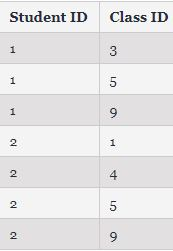

References:

:link: [Many-to-many relationships](https://dzone.com/articles/how-to-handle-a-many-to-many-relationship-in-datab)​

## Querying a Self-referencing Table with a Subquery

This method is some confusing because the `sintax` it is not clear at all

```sql
USE Chinook
GO
	SELECT FirstName, LastName
		-- Subquery
		(SELECT FirstName + ' ' + LastName
         	FROM Employee bosses
         	WHERE Employee.ReportsTo = bosses.EmployeId
    	) AS boss
	FROM Employee;
GO
```

> Where from the *Subquery*:
>
> - `SELECT` FirstName + ' ' + LastName => will be the value of the cell
> - `FROM` Employee bosses => "Employee" is the tabla and ''bosses' is the alias
> - `WHERE` => condition to meet
> - `AS` boss => column name to show

The result will be

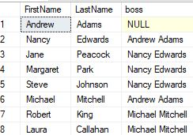

## Querying a Self-referencing Table Using a Join

```sql
USE Chinook
GO
	SELECT workers.FirstName, workers.LastName
	FROM Employee workers;
	LEFT JOIN Employee as bosses
	ON workers.ReportsTo = bosses=EmployeeId
GO
```

We will got the same result as querying with a sub-query but now the code its clearer

We have to use use `LEFT JOIN` to show `NULL` results

# Essential String and Date Functions

## Querying Strings with a Partial Results

In few words `Querying strings with wildcards`

```sql
SELECT * 
FROM <TableName>
WHERE <ColumnName> LIKE '<someString>%'
```

> Where:
>
> - `LIKE` => is a keyword to indicates that will be using a partial query
> - `%` => is the equivalent to `*` wildcard in other languages

## Partial String Results with Substring

In few words to show limit a field the content to show, e.g

`Word`: accept

`Result`: accep

```sql
SELECT <ColumnName>, SUBSTRING(ColumnName, 1 , 5)
FROM <TableName>
```

> Where:
>
> `1` => Start from the initial word
>
> `5` => cut the word at the word 5

## Editing String Results with Replace

As the title says, replace a word

```sql
SELECT *, REPLACE(<ColumnName>, '<someWord>', '<wordToReplace>') as <NewColumn>
FROM <TableName>
WHERE <ColumnName> LIKE '%<someWord>%'
```


# Linking Tables

## FOREIGN KEY

A `FOREIGN KEY` is a key used to link two tables together.

A `FOREIGN KEY` is a field (or collection of fields) in one table that refers to the `PRIMARY KEY` in another table.

The table containing the foreign key is called the child table, and the table containing the candidate key is called the referenced or parent table.

```sql
CONSTRAINT [FK_ProductBrief_SeriesID_Series_SeriesID] FOREIGN KEY (SeriesID) REFERENCES ProductBriefSeries(SeriesID) ON DELETE CASCADE
```

> Where:
>
> - `CONSTRAINT` => is the constraint for the column
> - `FK_ProductBrief_SeriesID_Series_SeriesID` => is the name of the `CONSTRAINT` where:
>   - FK => Foreign Key
>   - ProductBrief => The current table
>   - SeriesID => A column in the current table
>   - Series => A table in the database
>   - SeriesID => A column part of the `Series` table
> - `FOREIGN KEY` (SeriesID) => where `SeriesID` is a reference for a column in the current table
> - `REFERENCES` ProductBriefSeries(SeriesID): Where `ProductBriefSeries` is a table in the database and `SeriesID` is a column from that table
> - `ON DELETE CASCADE` => this mean that if the reference record is deleted, this too

Basically the concept is that to the column you assigned as `Foreign Key` can not has another value than the reference table.column in the database, if you try to insert a different value you will have an error

References:

- :link: [SQL - Server Foreign Key](https://www.w3schools.com/sql/sql_foreignkey.asp)

# Database

## Definition

- A database is
  - A container to help organize data
  - A way to efficiently store and retrieve data

## Relational model

A way to describe data and the relationships between data entities

> Database design is important, it controls the questions you can ask later
>
> `SQL` is the language you use to ask the questions


# Basic SQL Syntax

A `SQL` statement is an expression that tells a database what you want it to do

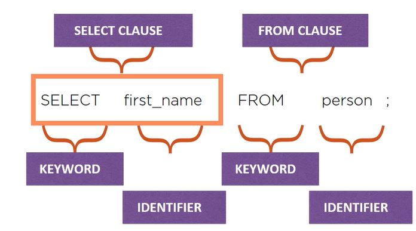

# SQL commands

## SELECT

> *SELECT* statement retrieves one or more rows from one or more tables

e.g

```sql
SELECT first_name, last_name FROM contacts;
```

Output:

| id   | first_name | last_name |
| ---- | ---------- | --------- |
| 1    | Jon        | Flanders  |

## INSERT

> Adds one or more rows into a table

e.g:

```sql
INSERT INTO contacts(first_name, last_name) VALUES("Fritz", "Onion");
```

Where `contacts` is the table to consult

Output:

| id   | first_name | last_name |
| ---- | ---------- | --------- |
| 1    | Jon        | Flanders  |
| 2    | Fritz      | Onion     |

## UPDATE

> Modifies one or more rows in a table

```sql
UPDATE contants SET last_name="Ahern" WHERE id=1;
```

Where `contacts` is the table to consult

## DELETE

> Removes one or more rows from one table

```sql
DELETE FROM contacts WHERE id = 2;
```

Where `contacts` is the table to consult